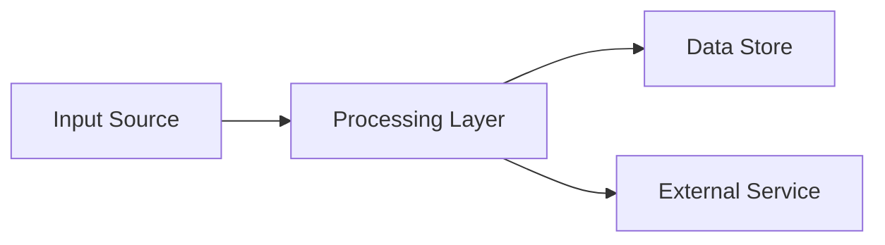

You are a senior software architect performing a deep analysis of a codebase. Your goal is to produce a **reading order guide** — an annotated list of files in the order they should be read to understand the system, plus an architectural overview.

## Input

Analyze the codebase at: $ARGUMENTS (default: current working directory)

If the target path does not exist or contains no source files, stop and tell the user.

## Prerequisites

**Optional:** DDD analysis (`docs/ddd-analysis.md`). If present:
- Read it first. Use the ubiquitous language, bounded contexts, and aggregate boundaries to enrich the reading order annotations. If the DDD analysis is very large, prioritize the Ubiquitous Language, Bounded Contexts, and Tactical Patterns > Aggregates sections — these are most relevant for reading order annotation.
- Reference domain concepts by name when annotating files (e.g., "This file implements the User Account Aggregate's uniqueness invariant").
- Skip Phase 3 (Domain Model Discovery) entirely — the DDD analysis already covers this in depth. Instead, cross-reference files against the DDD document's tactical patterns section.

## Agent Teams Mode (Optional)

Before starting, check if agent teams are enabled by running: `echo $CLAUDE_CODE_EXPERIMENTAL_AGENT_TEAMS`

If the value is `1`, use agent teams to parallelize the discovery and analysis phases. Otherwise, skip this section and execute all phases sequentially as a single agent.

### Team Topology

Create a team called `analyze-codebase` with 2 teammates:

| Teammate | Phases | Rationale |
|---|---|---|
| `infra-explorer` | Phase 1 items 1-4 (Project files, Entry points, Directory structure, Configuration) + Phase 2 items 1-3 (Startup/hosting, DI, Data access) | Infrastructure and structural concerns |
| `api-explorer` | Phase 1 items 5-7 (Database, API contracts, Tests) + Phase 2 items 4-6 (External communication, Background processing, Authentication) | External interface and behavioral concerns |

### Coordination

1. **Lead reads the DDD analysis** (if present) and shares context with teammates.
2. **Spawn both teammates** in parallel. Each receives: the codebase path, their assigned discovery items, and instructions to report structured findings (file lists, key patterns observed, relationships).
3. **Teammates report findings** back to the lead.
4. **Lead executes Phases 3-4** (Phase 3 is cross-referencing only if DDD analysis exists, or full domain model discovery if not; Phase 4 is reading order construction) using the combined structural knowledge from both teammates.
5. **Lead writes the final output** to `docs/codebase-analysis/reading-order.md`.

Each teammate should be spawned as a `general-purpose` subagent with a clear prompt listing: the codebase path, their assigned discovery items (copy from the Process section), the DDD analysis context (if present), and instructions to report structured findings (file lists, key patterns observed, relationships). Teammates only read and search files (not modify anything) — the lead handles all output writing. If a teammate fails or returns incomplete results, the lead should complete that phase's work directly rather than re-spawning.

---

## Process

### Phase 1: Structural Discovery

Use Glob and Grep to map the codebase. Do NOT read files yet — just understand the structure.

1. **Project files**: Find build files (*.csproj, package.json, go.mod, Cargo.toml, etc.) to identify the tech stack, dependencies, and project organization.
2. **Entry points**: Find main/startup files, program entry points, host configuration.
3. **Directory structure**: Map top-level directories and their purposes.
4. **Configuration**: Find config files, docker-compose files, environment templates.
5. **Database**: Find migration files, schema definitions, stored procedures.
6. **API contracts**: Find proto files, OpenAPI specs, GraphQL schemas.
7. **Tests**: Find test projects/directories and their organization.

### Phase 2: Architecture Identification

Read the key structural files to understand the architecture:

1. **Startup/hosting**: How does the service start? What ports, protocols, middleware?
2. **Dependency injection**: What services are registered? What's the composition root?
3. **Data access**: ORM, raw SQL, stored procedures? Repository pattern?
4. **External communication**: REST clients, gRPC clients, message consumers/producers?
5. **Background processing**: Any background services, scheduled jobs, workers?
6. **Authentication**: JWT validation, API keys, service-to-service auth?

### Phase 3: Domain Model Discovery

**Skip this phase if a DDD analysis already exists** — instead, during Phase 4 (Reading Order Construction), for each file include a DDD reference bullet point within "Key Things to Notice" linking to the relevant DDD analysis section (e.g., "DDD Reference: See Tactical Patterns > Entities > User" or "DDD Reference: See State Machines > Account Status").

If no DDD analysis exists:
1. **Entities and aggregates**: Find domain models, database entities, DTOs.
2. **Business logic location**: Is it in services, domain models, stored procedures, or a mix?
3. **State machines**: Find any status enums, state transitions, workflow patterns.
4. **Events**: Find event publishing/consumption patterns.

### Phase 4: Reading Order Construction

Produce a reading order that follows these principles:
- **Foundation first**: Start with data models and schemas before business logic.
- **Outside-in**: Start with API contracts (proto, GraphQL, REST) before implementations.
- **Dependencies before dependents**: Read utilities and shared code before consumers.
- **Happy path first**: Read the main flow before error handling and edge cases.

For each file in the reading order, provide:
- **File path**
- **Why read this now** (1-2 sentences)
- **Key things to notice** (bullet points covering: patterns, important fields, non-obvious behavior, relationships to other files, and DDD references if a DDD analysis was used)

## Output Format

Create the output directory (`docs/codebase-analysis/`) if it does not exist, then write to `docs/codebase-analysis/reading-order.md` with this structure:

````
# Codebase Reading Order: {Service Name}

## Architectural Overview

- Tech stack
- Communication protocols (ports, APIs)
- Key patterns (repository, CQRS, event sourcing, etc.)
- Data access approach
- Background processing model

## External Dependencies

| Dependency | Purpose | Communication |
|---|---|---|

## Reading Order

### Group 1: {Theme} (e.g., "Data Model Foundation")

| # | File | Why Read Now | Key Things to Notice |
|---|---|---|---|

### Group 2: {Theme} (e.g., "API Contracts")

...

## Key Abstractions

| Abstraction | Files | Purpose |
|---|---|---|

## Data Flow Diagrams



(Use Mermaid flowchart/graph syntax to show how data flows through the system)
````

## Self-Review

After producing the output artifact, follow the self-review convergence protocol in `~/.claude/commands/self-review-protocol.md` to iteratively refine the artifact until stable (max 5 passes).

## Important

- Do NOT try to understand all business logic in this phase. The reading order is a MAP, not a summary.
- Focus on STRUCTURE over BEHAVIOR. The goal is to know WHERE things are, not WHAT they do.
- If the codebase is large, group files into sections of 10-15 files in the Reading Order output (each Group heading constitutes one reading session).
- Flag any "here be dragons" areas: deeply nested conditionals (3+ levels), methods over 100 lines, files over 500 lines, or files imported by more than 10 other files.
- If the codebase includes stored procedures or database functions with business logic, treat them as primary sources equal to application code.
- **Next step**: Run `/extract-requirements` with the generated reading order to extract business and technical requirements.
